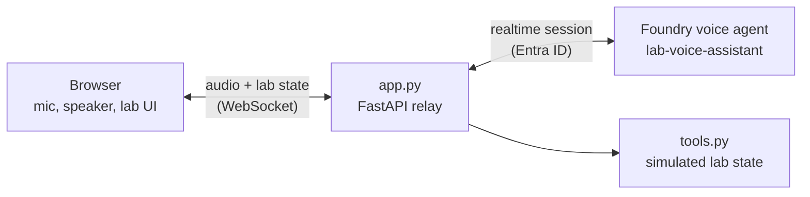

# Lab Bench Voice Assistant with Microsoft Foundry voice agents

A minimal, hands-on example of the new native **voice agents in Microsoft Foundry** (public preview).
"Vita" is a friendly voice assistant for a **simulated life science lab bench**: you talk to it in the
browser, gloves on, and it controls the bench lights, blinds, scenes, background music, and a
microscope camera, all drawn as a simple web UI. No real hardware needed.

Companion repo for the blog post
[Native Voice Agents in Microsoft Foundry: When Speech and Agent Become One](https://beyondelastic.github.io/posts/foundry-voice-agents/).

> **Preview:** voice agents in Microsoft Foundry are currently in public preview. APIs and
> defaults can change.
>
> **Demo only:** this is a simulation to explore the technology. Real lab equipment has its own
> safety requirements and procedures. See [Taking it further](#taking-it-further) for what a real
> setup would add.

## What it shows

- A **voice agent** (`kind: voice`) defined as code: model, instructions, voice, greeting, and tools
  live in the agent definition in Foundry ([create_agent.py](create_agent.py)).
- A **service-managed realtime model** (speech-to-speech), so there is no model deployment to manage.
- **Client-executed function tools**: the agent decides *what* to do, your app does it
  ([tools.py](tools.py)).
- A **browser voice UI** with barge-in. The browser never sees a token, the small
  FastAPI app holds the Entra ID credential and relays audio ([app.py](app.py)).
- **Echo cancellation that works with open speakers**: the browser sends what it plays as a
  reference signal, so Vita doesn't hear (and interrupt) herself. See [Avoiding self-interruption](#avoiding-self-interruption).

## Architecture



1. The browser streams microphone audio (PCM16, 24 kHz) to `app.py`, plus a second channel with
   what its speakers play (the echo reference).
2. `app.py` opens a realtime session with the voice agent and forwards the audio.
3. The agent listens, decides, and either talks back or calls a function tool.
4. `app.py` runs the tool, returns the result to the agent, and pushes the new lab state to the UI.

## Files

| File | What |
|---|---|
| [instructions.md](instructions.md) | Persona and rules for "Vita", written for speech. |
| [tools.py](tools.py) | Simulated lab state, 5 tools, JSON schemas, and `run_tool()`. |
| [create_agent.py](create_agent.py) | Creates or updates the voice agent in Foundry (new version each run). |
| [app.py](app.py) | FastAPI app: serves the UI and relays audio, tool calls, and state. |
| [static/](static) | The lab UI, mic capture worklet, audio playback, and music. |
| [static/music/](static/music) | Optional: your own `calm.mp3`, `focus.mp3`, `upbeat.mp3`. |

The tools:

| Tool | Example request |
|---|---|
| `set_lights` | "Dim the lights to 30 percent", "Make the lights blue", "Lights off" |
| `set_blinds` | "Close the blinds" |
| `set_scene` | "Set the scene to microscopy" (cell_culture, microscopy, cleanup, end_of_day) |
| `play_music` | "Play the focus playlist", "Pause the music" |
| `microscope_camera` | "Start recording", "Take a snapshot", "Stop the recording" |

## Prerequisites

- A [Microsoft Foundry project](https://learn.microsoft.com/en-us/azure/foundry/how-to/create-projects)
  in a region where the voice agent preview is available.
- The **Foundry User** role on the project.
- Python 3.10 or later and the [Azure CLI](https://learn.microsoft.com/en-us/cli/azure/install-azure-cli).
- Microsoft Edge or Google Chrome, and a microphone. Open speakers work, a headset is even better.

## Run it

```bash
python -m venv .venv && source .venv/bin/activate   # Windows: .venv\Scripts\activate
pip install -r requirements.txt
cp .env.example .env    # then set FOUNDRY_PROJECT_ENDPOINT
az login

python create_agent.py   # creates the voice agent (run again after changing it or pulling updates)
uvicorn app:app --reload
```

Open <http://localhost:8000>, click **Start session**, allow the microphone, and wait for Vita's
greeting. Then try "Set the scene to microscopy" or "Start recording".

## Configuration

| Variable | Default | What |
|---|---|---|
| `FOUNDRY_PROJECT_ENDPOINT` | (required) | `https://<account>.services.ai.azure.com/api/projects/<project>` |
| `FOUNDRY_VOICE_AGENT_NAME` | `lab-voice-assistant` | Agent name used by both scripts. |
| `FOUNDRY_VOICE_AGENT_MODEL` | `gpt-realtime` | Service-managed model. Check the **Models** page of your project for what's available. |
| `FOUNDRY_VOICE_AGENT_VOICE` | `en-US-AvaNeural` | Azure standard voice for the replies. |

To use your own model deployment instead of a managed model, set `model_type` to
`VoiceModelType.SELF_DEPLOYED` in `create_agent.py` and set the model to your deployment name.

## Avoiding self-interruption

With open speakers, the microphone also picks up Vita's voice and the music. Turn detection can then
think *you* are talking, and Vita stops mid-sentence. The demo uses three layers against that:

1. **Live-reference echo cancellation** ([create_agent.py](create_agent.py)). The agent is configured
   with `echo_cancellation` `reference_source="client"` and `channels=2`. The browser sends
   interleaved stereo PCM16: channel 0 is the microphone, channel 1 is everything the speakers play
   (Vita's voice *and* the music), see [mic-worklet.js](static/mic-worklet.js). The service subtracts
   the reference from the mic. This matters in a browser, because:
   - the browser's own echo cancellation is only required to cancel audio from WebRTC calls
     ([MDN](https://developer.mozilla.org/en-US/docs/Web/API/MediaTrackConstraints/echoCancellation)),
     not necessarily audio played through the Web Audio API, and
   - the default server reference assumes the client plays audio the moment it arrives, but the
     browser queues Vita's reply, and the music never comes from the service at all.
2. **Noise suppression and semantic turn detection**: `azure_deep_noise_suppression` plus
   `azure_semantic_vad` with `remove_filler_words`, a slightly higher `threshold` (0.6), and a minimum
   `speech_duration_ms`, so short noises and filler words don't count as an interruption.
3. **Music ducking**: the music drops to a low volume while Vita talks.

`app.py` reads the agent's echo setting at the start of each session and tells the browser whether
to send mono or stereo, so the two always match. **Run `python create_agent.py` again** to apply the
settings to an existing agent.

Still interrupted? Raise `threshold` (for example to 0.7), set `interrupt_response=False` to turn
off barge-in completely, or use a headset.

## Music

The `play_music` tool switches between three playlists. Options for the actual sound, from
simplest to most "real":

| Option | Effort | Notes |
|---|---|---|
| **Built-in synth** (default) | none | A small generative arpeggio per playlist, made with the Web Audio API. Works offline, no licensing. |
| **Your own files** | drop in 3 files | Add `calm.mp3`, `focus.mp3`, `upbeat.mp3` to [static/music/](static/music). They're picked up automatically, ducked, and included in the echo reference. Use music you have the rights to; the files are git-ignored. |
| **Spotify embed** | ~30 lines | The [Spotify iFrame API](https://developer.spotify.com/documentation/embeds/references/iframe-api) can load and play a playlist from JavaScript without OAuth. But the audio plays inside a cross-origin iframe, so it can't be ducked or included in the echo reference, and what plays depends on the listener's Spotify login. |

Internet radio streams look tempting, but check the station's terms first: many don't allow use in
third-party players.

## Taking it further

The demo listens all the time and reacts to everything it hears. In a real lab, where people talk
across benches all day, you'd add a **wake word** ("Hey Vita") as a gate: the app only starts streaming microphone
audio to the voice agent after the wake word fired. Options:

- [Picovoice Porcupine](https://github.com/Picovoice/porcupine): has a web SDK that runs on-device in
  the browser, so it fits this app directly. Custom wake words are created in the Picovoice Console,
  and it needs a Picovoice AccessKey.
- [openWakeWord](https://github.com/dscripka/openWakeWord): open source (Python), you can train your
  own wake word from synthetic speech.
- Azure AI Speech [custom keyword](https://learn.microsoft.com/en-us/azure/ai-services/speech-service/keyword-recognition-overview):
  runs on-device with the Speech SDK (not the JavaScript SDK). Note that Speech Studio shows a notice
  that custom keyword model training will be retired on August 1, 2027 (existing models keep working).

Other ideas: replace the simulated tools with real device APIs through an MCP server or a Foundry
toolbox, add a transcription phrase list for lab vocabulary (reagents, cell lines, instruments), or
connect a phone line with the built-in telephony channels.

## Troubleshooting

- **The agent hears itself and interrupts its own replies:** run `python create_agent.py` again
  so the agent has the echo cancellation settings, then see [Avoiding self-interruption](#avoiding-self-interruption).
- **Connection fails right away:** check `FOUNDRY_PROJECT_ENDPOINT`, run `az login`, confirm you
  have the Foundry User role, and run `python create_agent.py` first.
- **`create_agent.py` fails on the model:** pick a model that the voice agent preview supports in your
  project's region and set `FOUNDRY_VOICE_AGENT_MODEL`.
- **Mic doesn't work in Firefox:** the UI captures audio with a 24 kHz `AudioContext`, which
  Firefox can't connect to a microphone stream. Use Edge or Chrome.
- **WSL:** works fine, the audio is captured and played by the browser, not by Python.

## Learn more

- [Introducing voice agents in Microsoft Foundry](https://techcommunity.microsoft.com/blog/azure-ai-foundry-blog/introducing-voice-agents-in-microsoft-foundry/4557276)
- [Quickstart: Create a voice-based prompt agent](https://learn.microsoft.com/en-us/azure/foundry/agents/quickstarts/prompt-voice-agent)
- [Configure a voice agent](https://learn.microsoft.com/en-us/azure/foundry/agents/how-to/configure-voice-agent)
- [Migrate from Voice Live with Foundry Agent Service](https://learn.microsoft.com/en-us/azure/foundry/agents/how-to/migrate-from-voice-live)
- [How to use the Voice Live API (incl. Live-Reference AEC)](https://learn.microsoft.com/en-us/azure/ai-services/speech-service/voice-live-how-to)

## License

[MIT](LICENSE)
